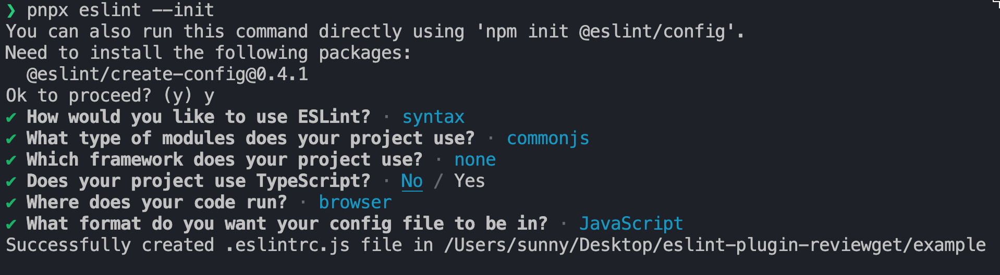
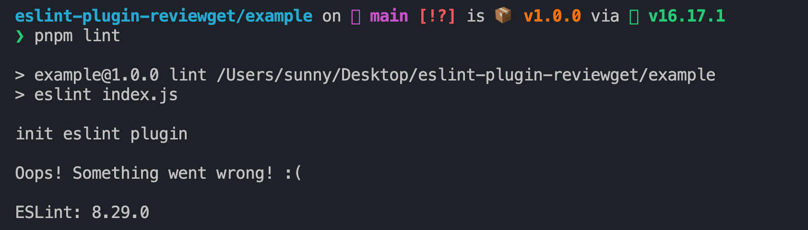

# eslint-plugin-reviewget

## Feature
- 当用户使用 getXXX  get开头的函数的时候  如果不返回值的话 那么就会报错
- 可以 fix
- 用户可以自行配置是否 fix


## DO

eslint-plugin-xxx:  插件命名规范

测试插件：

### 1. demo测试

```shell
pnpm init -y
pnpm i eslint -D
pnpx eslint --init
```


配置 .eslintrc.js

```js
module.exports = {
    "root": true,
    "env": {
        "browser": true,
        "commonjs": true,
        "es2021": true
    },
    "overrides": [
    ],
    "parserOptions": {
        "ecmaVersion": "latest"
    },
    "plugins": [
        "reviewget"
    ],
    "rules": {
        "reviewget/get": ["warn"]
    }
}

```

在`eslint-plugin-reviewget/example`下安装本地写好的插件

```shell
pnpm i ../
```



### 2. 单元测试环境

创建`reviewget.spec.js`文件

```js
const { RuleTester } = require("eslint")
const { rules } = require('./index')

const ruleTester = new RuleTester()
ruleTester.run('get', rules.get, {
    valid: [
        {
            name: 'success',
            code: `function getName(){ return ''}`
        }
    ],
    invalid: [


    ]
})


```

watch 模式, 利用 mocha 测试库

```shell
pnpm test -- --watch
```

