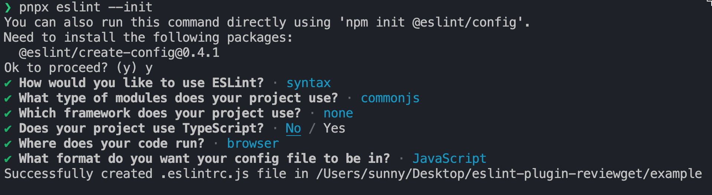

# eslint-plugin-reviewget

## Feature
- 当用户使用 getXXX  get开头的函数的时候  如果不返回值的话 那么就会报错
- 可以 fix
- 用户可以自行配置是否 fix


## DO

eslint-plugin-xxx:  插件命名规范

测试插件：

### 1. demo测试

```shell
pnpm init -y
pnpm i eslint -D
pnpx eslint --init
```


### 2. 单元测试